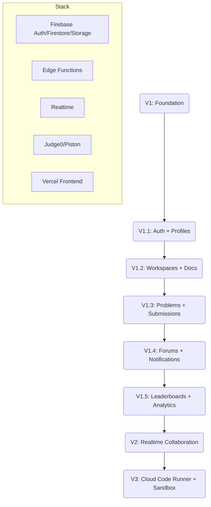

# CodeCampus Production Roadmap

## Milestones

- V1 Foundation
  - Project setup, envs, Firebase config, schema, security rules
  - Minimal UI wiring (login, profile fetch)

- V1.1 Auth + Profiles
  - Google + Azure AD OAuth
  - Domain enforcement -> college membership
  - Profile edit page

- V1.2 Workspaces + Docs
  - CRUD workspaces, docs
  - Auto-save + periodic versioning
  - RLS and access control (owner/college)

- V1.3 Problems + Submissions
  - Problems listing, detail
  - Code submission -> Edge Function -> Judge0
  - Store results, rate limit

- V1.4 Forums + Notifications
  - Threads/posts per college
  - Reactions, basic mentions
  - In-app notifications

- V1.5 Leaderboards + Analytics
  - Aggregates per college
  - Weekly snapshots

- V2 Realtime Collaboration
  - Presence, cursors
  - CRDT-based doc sync (Yjs)

- V3 Runner + Sandbox
  - Containerized runner (optional self-host)
  - Time/memory quotas
